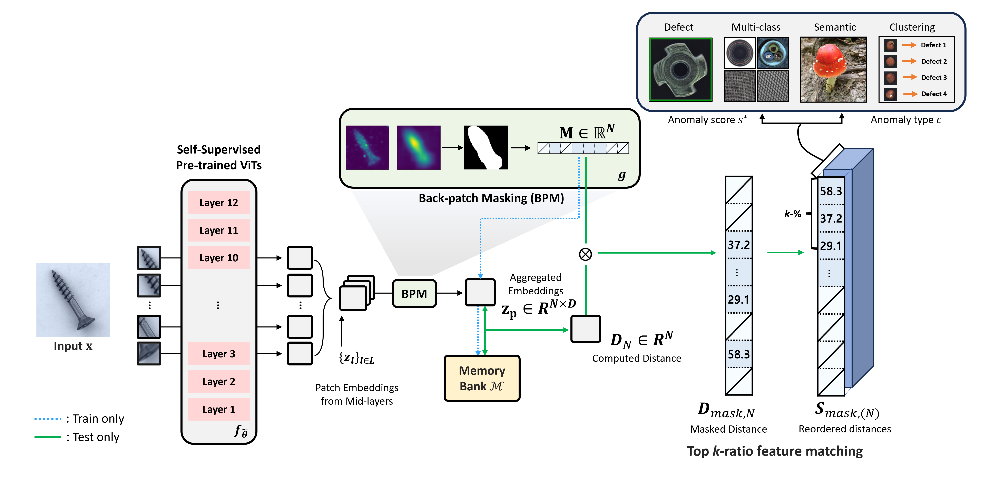

# UniFormaly: Towards Task-Agnostic Unified Anomaly Detection

This repository contains the official PyTorch implementation of _UniFormaly_: Towards Task-Agnostic Unified Anomaly Detection.   

   



## 0. Prepare Enviroments
- Ubuntu 18.04
- Python 3.8.10
- conda 4.8.3
- NVIDIA A100 80GB

### Install Conda
```
wget https://repo.anaconda.com/archive/Anaconda3-2020.07-Linux-x86_64.sh
if [[ "$(md5sum **Anaconda3**-2020.07-Linux-x86_64.sh | cut -d' ' -f1)" == "1046c40a314ab2531e4c099741530ada" ]]; then echo "OK"; else echo "No"; fi
```

```
chmod +x Anaconda3-2020.07-Linux-x86_64.sh
./Anaconda3-2020.07-Linux-x86_64.sh
rm Anaconda3-2020.07-Linux-x86_64.sh
```
After installation, please close terminal and reopen it!

### Create Conda Virtual Environment
```
conda env create -f uniformaly_env.yaml
conda activate uniformaly
```

## 1. Prepare Dataset
To download MVTecAD, excute the following:
```
bash prepare_dataset.sh
```
Following the file structure below and set your dataset path.
- [MVTecAD](https://www.mvtec.com/company/research/datasets/mvtec-ad/) for one-class classification
```
YOUR_MVTEC_PATH/
├── bottle
│   ├── ground_truth
│   │   ├── broken_large
│   │   ├── broken_small
│   │   └── contamination
│   ├── train
│   │   ├── good
│   └── test
│   │   ├── broken_large
│   │   ├── broken_small
│   │   ├── contamination
│   │   └── good
├── cable
│   ├── ground_truth
│   │   ├── bent_wire
│   │   ├── cable_swap
│   │   ├── ...
│   ├── train
│   │   ├── good
│   └── test
│       ├── bent_wire
│       ├── cable_swap
│       ├── ...
│       └── good
├── ...
└── zipper
```

- [MVTecAD](https://www.mvtec.com/company/research/datasets/mvtec-ad/) for multi-class classification

  We reorganized MVTecAD into three branches for multi-class setup:
  - **ground_truth** (contains anomaly masks),
  - **train** (contains all normal images)
  - **test** (contains all anomaly images)
```
YOUR_MVTEC_MULTI_PATH/
├── ground_truth
│   ├── bottle_broken_large
│   │   ├── 000_mask.png
│   │   ├── 001_mask.png
│   │   ├── ..
│   ├── bottle_broken_small
│   │   ├── 000.png
│   │   ├── 001.png
│   │   ├── ...
│   ├── bottle_contamination
│   ├── ...
│   └── zipper_squeezed_teeth
├── train
│   ├── bottle_good
│   │   ├── 000.png
│   │   ├── 001.png
│   │   ├── ...
│   ├── cable_good
│   ├── capsule_good
│   ├── ...
│   └── zipper_good
└── test
    ├── bottle_broken_large
    │   ├── 000.png
    │   ├── 001.png
    │   ├── ...
    ├── bottle_broken_small
    ├── bottle_contamination
    ├── ...
    └── zipper_squeezed_teeth
```

- [Species-60](https://github.com/hendrycks/anomaly-seg)

For Species-60, we provide details on 60 classes in our Appendix. If you would like to reproduce results for Species-60, please refer to our Appendix and prepare datasets as below. 
```
YOUR_SPECIES60_PATH/
├── one_class_test
│   ├── abudefduf_vaigiensis
│   │   ├── 14683823.jpg
│   │   ├── 19987354.jpg
│   │   ├── ...
│   ├── acanthurus_coeruleus
│   ├── acarospora_socialis
│   ├── ...
│   └── zelus_renardii
└── one_class_train
    ├── abudefduf_vaigiensis
    │   ├── 10026878.jpeg
    │   ├── 10126060.jpg
    │   ├── ...
    ├── acanthurus_coeruleus
    │   ├── ...
    ├── ...
    └── zelus_renardii
```
We also used CIFAR-10/100, ImageNet-30, MTD, BTAD, and CPD datasets.


## 2. How to execute _UniFormaly_

### Defect Detection
```
bash run_defect.sh
```

### Semantic Anomaly Detection
  
For semantic anomaly detection, we provide scripts for each dataset.

- Species-60
```
bash run_species.sh
```

- ImageNet-30
```
bash run_imagenet.sh
```

- CIFAR-10
```
bash run_cifar10.sh
```

- CIFAR-100
```
bash run_cifar100.sh
```


### Multi-class Anomaly Detection
For multi-class anomaly detection, we provide scripts for each dataset.
- MVTecAD
```
bash run_mvtec_multi.sh
```
- Species-60
```
bash run_species_multi.sh
```
- CIFAR-10
```
bash run_cifar10_multi.sh
``` 


### Anomaly Clustering
```
bash run_clustering.sh
```

## 3. Citation & Acknowledgements
Our repository is based on [PatchCore](https://github.com/amazon-science/patchcore-inspection).   
Please consider citing them in your publications if they help your research.
```
@inproceedings{roth2022towards,
  title={Towards total recall in industrial anomaly detection},
  author={Roth, Karsten and Pemula, Latha and Zepeda, Joaquin and Sch{\"o}lkopf, Bernhard and Brox, Thomas and Gehler, Peter},
  booktitle={Proceedings of the IEEE/CVF Conference on Computer Vision and Pattern Recognition},
  pages={14318--14328},
  year={2022}
}
```

```
@inproceedings{caron2021emerging,
  title={Emerging properties in self-supervised vision transformers},
  author={Caron, Mathilde and Touvron, Hugo and Misra, Ishan and J{\'e}gou, Herv{\'e} and Mairal, Julien and Bojanowski, Piotr and Joulin, Armand},
  booktitle={Proceedings of the IEEE/CVF international conference on computer vision},
  pages={9650--9660},
  year={2021}
}
```

```
@article{zhou2021ibot,
  title={ibot: Image bert pre-training with online tokenizer},
  author={Zhou, Jinghao and Wei, Chen and Wang, Huiyu and Shen, Wei and Xie, Cihang and Yuille, Alan and Kong, Tao},
  journal={arXiv preprint arXiv:2111.07832},
  year={2021}
}
```
